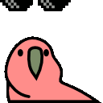

# HTML Image Test

Test cases for HTML \`\` tag rendering in the editor.

## Basic Image

## Right-Aligned Image

This paragraph should wrap around the image which is floated to the right side. The image has an explicit width of 160 pixels. Text continues to flow normally on the left side of the image. Adding more text here so we can see the wrapping behavior clearly.

## Left-Aligned Image

This paragraph should wrap around the image which is floated to the left side. The image has an explicit width of 160 pixels. Text continues to flow normally on the right side of the image. Adding more text here so we can see the wrapping behavior clearly.

## Center-Aligned Image

## Width and Height

## Void Form (No Trailing Slash)

## Remote URL

## Security: Blocked Sources

These should show "Blocked image" indicators, not render:

## Fallback: Broken Image

## Preserved Attributes

This image has extra attributes that should roundtrip losslessly:

