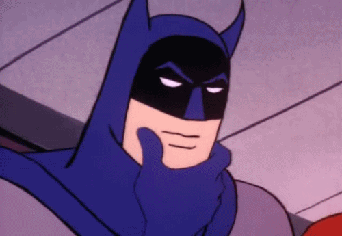

# HTML Image Test

## Right-Aligned Image!

Text that should wrap around the image on the right side. Adding more text here so we can see the wrapping behavior clearly. The image should float to the right.

## Left-Aligned Image

Text that should wrap around the image on the left side. Adding more text here so we can see the wrapping behavior clearly. The image should float to the left.

## Security: Blocked Source

