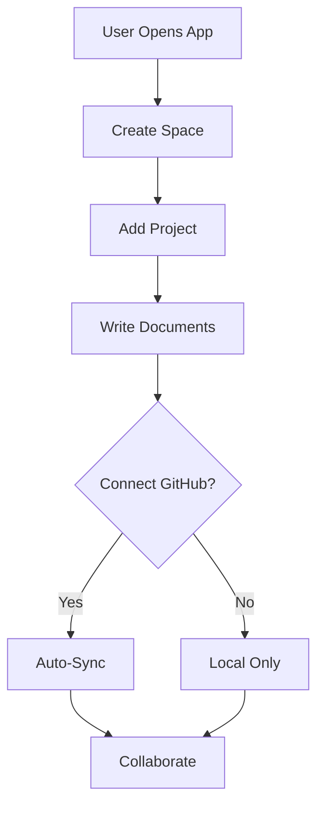
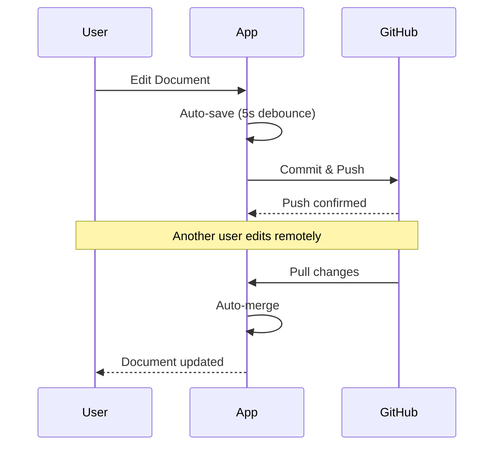
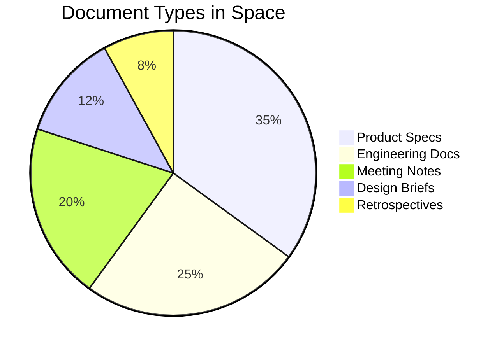
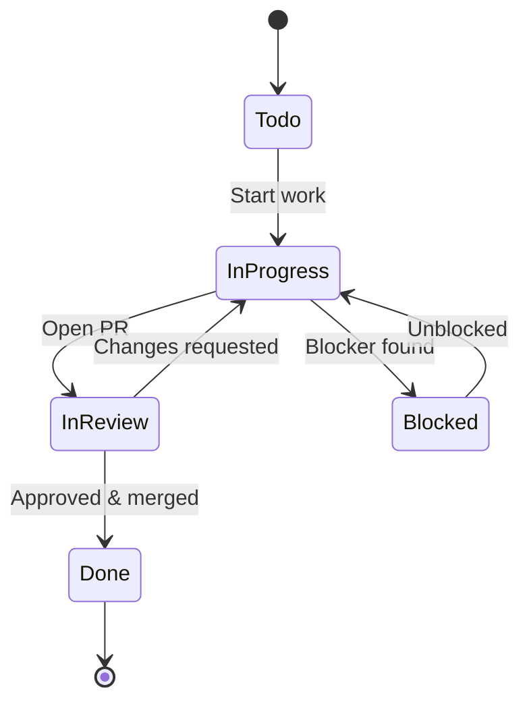
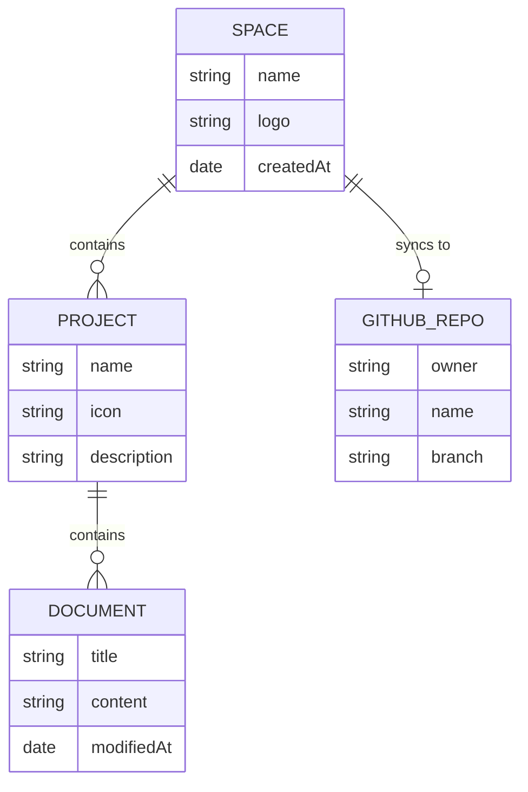
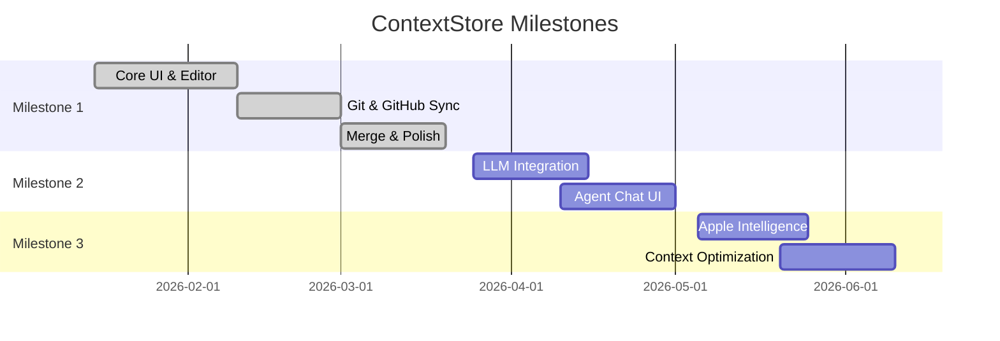
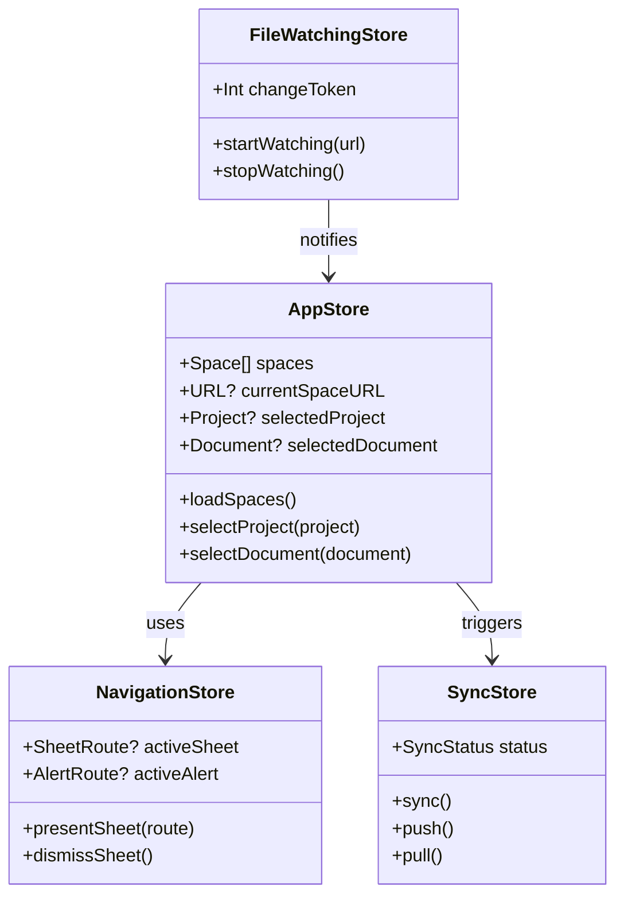
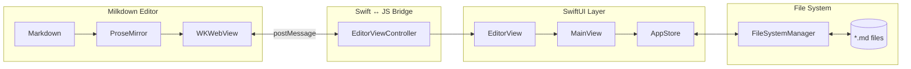

# Mermaid diagrams

Diagram:

```mermaid
graph TD
    A[User Opens App] --> B[Create Space]
    B --> C[Add Project]
    C --> D[Write Documents]
    D --> E{Connect GitHub?}
    E -->|Yes| F[Auto-Sync]
    E -->|No| G[Local Only]
    F --> H[Collaborate]
    G --> H
```

```mermaid
sequenceDiagram
    participant User
    participant App
    participant GitHub
    User->>App: Edit Document
    App->>App: Auto-save (5s debounce)
    App->>GitHub: Commit & Push
    GitHub-->>App: Push confirmed
    Note over User,GitHub: Another user edits remotely
    GitHub->>App: Pull changes
    App->>App: Auto-merge
    App-->>User: Document updated
```

```mermaid
pie title Document Types in Space
    "Product Specs" : 35
    "Engineering Docs" : 25
    "Meeting Notes" : 20
    "Design Briefs" : 12
    "Retrospectives" : 8
```

```mermaid
stateDiagram-v2
    [*] --> Todo
    Todo --> InProgress: Start work
    InProgress --> InReview: Open PR
    InReview --> InProgress: Changes requested
    InReview --> Done: Approved & merged
    InProgress --> Blocked: Blocker found
    Blocked --> InProgress: Unblocked
    Done --> [*]
```

```mermaid
erDiagram
    SPACE ||--o{ PROJECT : contains
    PROJECT ||--o{ DOCUMENT : contains
    SPACE ||--o| GITHUB_REPO : "syncs to"
    SPACE {
        string name
        string logo
        date createdAt
    }
    PROJECT {
        string name
        string icon
        string description
    }
    DOCUMENT {
        string title
        string content
        date modifiedAt
    }
    GITHUB_REPO {
        string owner
        string name
        string branch
    }
```

```mermaid
gantt
    title ContextStore Milestones
    dateFormat YYYY-MM-DD
    section Milestone 1
        Core UI & Editor       :done, m1a, 2026-01-15, 2026-02-10
        Git & GitHub Sync      :done, m1b, 2026-02-10, 2026-03-01
        Merge & Polish         :done, m1c, 2026-03-01, 2026-03-20
    section Milestone 2
        LLM Integration        :m2a, 2026-03-25, 2026-04-15
        Agent Chat UI          :m2b, 2026-04-10, 2026-05-01
    section Milestone 3
        Apple Intelligence     :m3a, 2026-05-05, 2026-05-25
        Context Optimization   :m3b, 2026-05-20, 2026-06-10
```

```mermaid
classDiagram
    class AppStore {
        +Space[] spaces
        +URL? currentSpaceURL
        +Project? selectedProject
        +Document? selectedDocument
        +loadSpaces()
        +selectProject(project)
        +selectDocument(document)
    }
    class NavigationStore {
        +SheetRoute? activeSheet
        +AlertRoute? activeAlert
        +presentSheet(route)
        +dismissSheet()
    }
    class FileWatchingStore {
        +Int changeToken
        +startWatching(url)
        +stopWatching()
    }
    class SyncStore {
        +SyncStatus status
        +sync()
        +push()
        +pull()
    }
    AppStore --> NavigationStore : uses
    AppStore --> SyncStore : triggers
    FileWatchingStore --> AppStore : notifies
```

```mermaid
flowchart LR
    subgraph Editor["Milkdown Editor"]
        MD[Markdown] --> PM[ProseMirror]
        PM --> WK[WKWebView]
    end
    subgraph Bridge["Swift ↔ JS Bridge"]
        WK <-->|postMessage| EVC[EditorViewController]
    end
    subgraph Swift["SwiftUI Layer"]
        EVC --> EV[EditorView]
        EV --> MV[MainView]
        MV --> AS[AppStore]
    end
    subgraph Disk["File System"]
        AS <--> FSM[FileSystemManager]
        FSM <--> Files[(*.md files)]
    end
```
